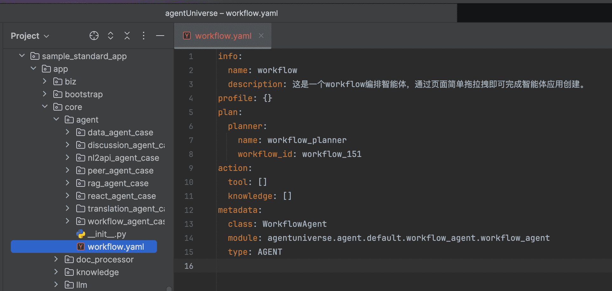

# Product Platform Advancement Guide
In this section, we will show you how to:
* Workflow Agent Orchestration Feature
* Table Form Agent Creation Feature
* Custom Knowledge Insertion Feature
* Custom Plugin Insertion Feature

## Workflow Agent Orchestration Feature
``` text
Note: For old users of the agentUniverse productization platform orchestration capability, please upgrade the magent-ui package version to 0.1.17, and the corresponding aU version must not be lower than 0.0.13. You can use the following command for version-specific installation:

pip install magent-ui==0.1.17 ruamel.yaml --force-reinstall
```
### Create Workflow Agent
On the aU-product homepage, click the "Create Agent" button to the right of the agent tab, and select the workflow type agent.


### Workflow Node Type
The current aU product platform supports 7 types of nodes, which are:
- **Start Node**: define the initial parameters for launching a workflow process.
- **Tool Node**: provide third-party plugin capabilities for the workflow.
- **Knowledge Node**: retrieve text content related to the user's query from the knowledge base, which can serve as context for downstream LLM node.
- **LLM Node**: invoke large language models to answer questions or process natural language.
- **Agent Node**: invoke and execute existing agent applications.
- **If-else Node**: split the workflow into multiple branches based on if/else conditional judgments.
- **End Node**: define the final output content at the end of a workflow process.

### Workflow Agent Orchestration
On the canvas, connect different types of workflow nodes to build a complete workflow process.

Click the Save button, and aU will automatically generate the corresponding workflow and agent YAML files locally to assist users in completing development work.

``` text
Note: Please ensure that the logic for passing parameters between nodes is correct; otherwise, it will cause the workflow to fail.
```

The complete workflow process is shown in the following figure:


The configuration file for the agent generated by aU is shown in the following figure:


### Run Workflow Agent
After clicking the save button, start attempting to run the workflow agent.

The operation process is as shown in the figure:


## Table Form Agent Creation Feature
### Create Table Form Agent
On the product homepage, click the 'Create Agent' button to the right of the agent tab, and select the RAG or ReAct type agent.

aU will automatically generate the corresponding agent yaml file locally, assisting users in completing their development work.


### Run Agent
After clicking the save button, start attempting to run the created example RAG agent.

The operation process is as shown in the figure:


## Custom Knowledge Insertion Feature
### Create Custom Knowledge
On the product homepage, switch to the Knowledge tab, and click the 'Add Knowledge' button to the right to create a custom knowledge base.

aU will automatically generate the corresponding knowledge and store yaml files locally, assisting users in completing their development work.


### Upload Knowledge
Specify the knowledge base, click the upload button, and upload the local knowledge file.

After the upload is successful, you can use the corresponding knowledge base in the knowledge node of the workflow agent or the knowledge module of the table form agent to retrieve content related to user questions.

```text
Currently supported knowledge types are: pdf/docx/pptx/txt
```
The upload operation is as shown in the figure:


## Custom Plugin Insertion Feature
### Create Custom Plugin
On the product homepage, switch to the Plugin tab, and click the 'Create Plugin' button to the right to create a custom plugin.


After successful creation, you can use the corresponding tools in the tool nodes of the workflow agent or the tool modules of the table form agent, providing powerful third-party plugin capabilities to support the agent.

Plugin schema example reference document: [schema](https://openai.xiniushu.com/docs/plugins/examples)

## More
The agentUniverse-product platform is continuously iterating, and more convenient and useful features will be available for community users to experience in the future. We also welcome your valuable suggestions.

This feature is jointly launched by [difizen](https://github.com/difizen/magent) and agentUniverse.

Let’s explore and progress together!