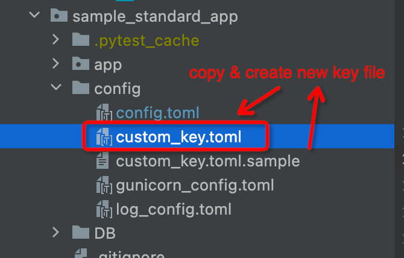
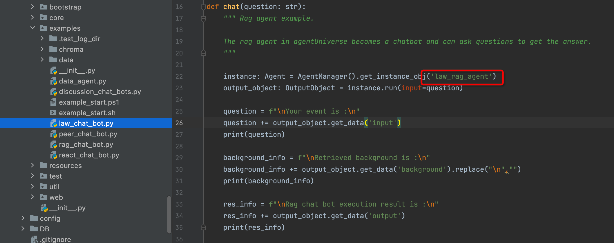
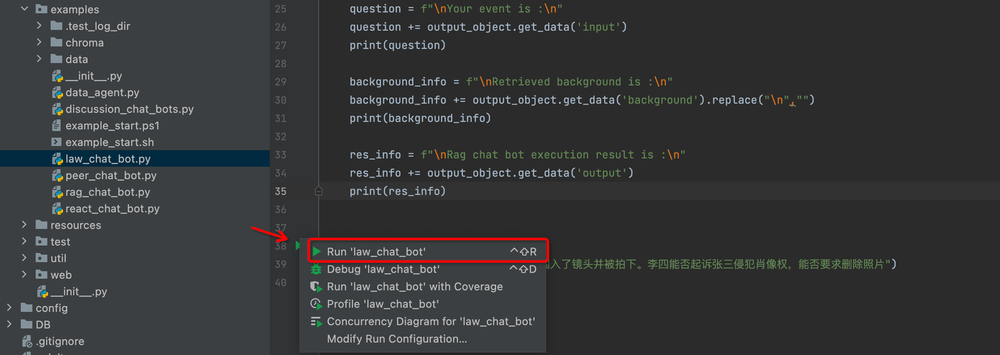

# Run the first example
Through this document, you will learn how to quickly run examples of agentUniverse and personally experience its effects.

## 1.Preparation Work
Before running the example case, ensure that you have installed the necessary runtime environment and completed the project setup.

### 1.1 Preparation of the environment
agentUniverse supports three operating system platforms: `macos`, `linux`, and `windows`. The configuration details for each platform may vary slightly. We won't go into detail here, but you can check the documentation for the necessary steps to ensure all requirements are met, and search for corresponding software configuration tutorials based on your specific platform.

#### 1.1.1 Preparing Python environment
Using **Python 3.10** version

Tips: If you have other Python version environments installed on your computer, it is strongly recommended that you use environment management tools like conda to isolate different multiple Python environments.

#### 1.1.2 Development Tool Preparation
AgentUniverse is designed for standard containerized delivery and includes standard images. You can run and modify the source code via shell during the development phase, but this method is not very efficient.

Although this section is not mandatory, we strongly recommend that you install a Python-oriented IDE tool. For an optimal Python development experience, we recommend using PyCharm, followed by VSCode (although configuring VSCode for Python development can be more cumbersome, so it is not advisable for beginners in Python development).

Don't forget to configure the Python interpreter in your chosen IDE tool.

### 1.2 Project Setup
#### 1.2.1 Sample Project Setup
You can download the agentUniverse source code from the project portal webpage or by using `git clone`. After completing this section, you will obtain the following project structure, where the `sample_standard_app` folder contains the sample project code, and this folder is located one level below the root directory, which is `agentUniverse`.

```text
➜  agentUniverse ✗ tree -L 1
.
├── CHANGELOG.md
├── CHANGELOG_zh.md
├── LICENSE
├── README.md
├── README_PYPI.md
├── README_jp.md
├── README_zh.md
├── agentuniverse
├── agentuniverse_connector
├── agentuniverse_extension
├── agentuniverse_product
├── dataset
├── dist
├── docs
├── poetry.toml
├── pyproject.toml
├── sample_standard_app
└── tests
```

Tips: To simplify the setup, please do not modify any project directories or rename folders for now. AgentUniverse supports arbitrary project directory structures, which requires some additional configuration. We will explain its usage in other sections.

#### 1.2.2 Install the corresponding framework package
```shell
# framework package
pip install agentUniverse

# Visualization Interface Package
pip install magent-ui ruamel.yaml
```

#### 1.2.3 AK Configuration
This framework supports key injection through environment variables, file configuration, and other methods. We will explain the complete usage in a separate chapter on key settings. Here, we will demonstrate the steps for configuring keys through a file. Please carefully check whether the following steps are followed in order：

##### step1. Confirm that the config file enables automatic reading of the external key file
Locate the main configuration file in the project (path: agentUniverse/sample_standard_app/config/config.toml). Find the SUB_CONFIG_PATH configuration item, and uncomment the custom_key_path configuration item as shown in the picture below:


This step will enable the project to automatically read configuration files and batch load keys. We can see that the custom_key_path configuration option already includes one default path. To simplify the tutorial, we will not modify the path here.

##### step2. Create an external key file based on the template
The external key file template is located at the same level as the config path (specifically at sample_standard_app/config/custom_key.toml.sample). We will copy custom_key.toml.sample and create a new file, naming it custom_key.toml in accordance with the default configuration of custom_key_path from step 1, as shown in the image below:


Tips: The external key file generally contains all of your access keys (AK), which are very private and need to be strictly protected. This file should never be leaked or managed on code platforms like Git. In actual production projects, we typically separate this file from the project and implement strong system-level permission controls. The steps in the key configuration of this framework are mainly for the sake of production security.

##### step3. In the external key file, configure your commonly used model AK
The key file contains dozens of common model service AK formats. You can fill in your own keys according to your needs, and don't forget to uncomment them. In subsequent tutorials, we will use the Qwen and GPT models as the LLM for the tutorial agent, so here we will configure the corresponding AK for Qianwen and GPT as shown in the image below:


## 2. Run the first example
The agentUniverse currently includes 5 official tutorial cases, located at agentUniverse/sample_standard_app/app/examples.

In this section, we will run the first example, choosing the law_chat_bot as our first tutorial case.

### 2.1 Determine the agent used behind the example and its configuration
For instance, in the case of law_chat_bot (path: agentUniverse/sample_standard_app/app/examples/law_chat_bot.py), we first identify the corresponding agent_name in the script. For the law_chat_bot, it is law_rag_agent:


After determining the agent used in the example, we go to the project agent directory (the directory path is: agentUniverse/sample_standard_app/app/core/agent) and find the corresponding agent configuration file law_rag_agent.yaml. Note that the name field in the agent configuration corresponds to the agent name in law_chat_bot.


Let's further examine the other configuration details in the law_rag_agent.yaml file, focusing on the llm_model configuration item. This item specifies the LLM used by the agent. By default, law_rag_agent uses the qwen series, specifically qwen-max, as the model core. If you configured a different series model type during the key configuration stage, you'll need to replace it here. You can refer to the following common model replacements. You can copy the default settings, and if needed, you can replace the model_name according to the official model codes of the service provider.

Qwen Model
```text
  llm_model:
    name: 'qwen_llm'
    model_name: 'qwen-max'
```

gpt Model
```text
  llm_model:
    name: 'demo_llm'
    model_name: 'gpt-4o'
```

WenXin Model
```text
  llm_model:
    name: 'wenxin_llm'
    model_name: 'ERNIE-3.5-8K'
```

kimi Model
```text
  llm_model:
    name: 'kimi_llm'
    model_name: 'moonshot-v1-8k'
```

BaiChuan Model
```text
  llm_model:
    name: 'baichuan_llm'
    model_name: 'Baichuan2-Turbo'
```

DeepSeek Model
```text
  llm_model:
    name: 'deep_seek_llm'
    model_name: 'deepseek-chat'
```

Tips: To simplify the configuration process, we only list a selection of commonly used model services here. In addition to model service providers, local deployment models can also be configured. We will not demonstrate this in this chapter, but users with such needs can further refer to the chapters related to LLM configuration.


### 2.2 Run the Example
By following the steps above, you have completed all the preparatory work. Now, let's run it and see the results. Locate the agentUniverse/sample_standard_app/app/examples/law_chat_bot.py file and run it in your IDE or in the shell.



When you see the following results, it indicates that the case has run successfully.


## 3. Run the other example
You have completed the execution of the first case. In other official examples, we used the google_search_tool, which provides your agent with web search capabilities. To experience other use cases, we recommend that you apply for a SERPER API key and pre-configure the search tool's API key. Serper has provided thousands of free search credits for your experience.

You need to apply for the SERPER_API_KEY on the official Serper website and configure it. The official website address is:  https://serper.dev

After applying, find the corresponding key in the custom_key.toml configuration file and uncomment it as shown.

```toml
#Google search
SERPER_API_KEY='xxxxxx'
```

Follow the steps in Section 2 to execute other cases. You can now reference and run all official cases.
