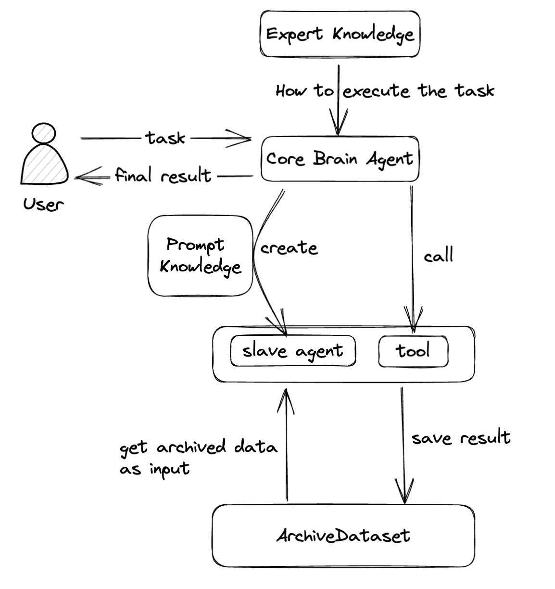

## Core Brain Agent

### What is a Core Brain Agent?
A Core Brain Agent (CBA) is capable of analyzing tasks provided by users based on human expert knowledge and dynamically breaking down the task execution steps. It accomplishes these steps by dynamically creating and calling sub-agents or tools. Ultimately, the Core Brain Agent completes the task requested by the user.

- The Core Brain Agent does not directly participate in the task execution. It is only responsible for breaking down the task and then using sub-agents and tools to execute the broken-down steps.
- The basis for task decomposition comes from real human expert knowledge. Users only need to provide expert knowledge in natural language form, and the Core Brain Agent can dynamically break down the task and execute the steps. This reduces the need for hardcoding standard operating procedures (SOPs) and increases the flexibility of the agent.
- The Core Brain Agent creates different sub-agents by utilizing a prompt knowledge base. Expanding this knowledge base allows the Core Brain Agent to create a wider variety of sub-agents, which improves the completion of the broken-down steps.
- The results of sub-agent and tool executions are stored in an Archive Dataset, making them available for use in subsequent steps. For the Core Brain Agent, it only needs to view the summary of these results to determine which data is needed for each step and pass the corresponding key-value to the tool or sub-agent. This avoids issues like hallucinations or poor compliance when the Core Brain Agent faces long contexts, making it more suitable for complex tasks.


### Workflow of the Core Brain Model

**Input**: 
- Expert knowledge `E`  
- Task goal `Q`

**Resources**:  
- Toolset `Tools`：Simple task-handling functions that can be directly called  
- Prompt knowledge base `PromptKnowledge`：Provides prompts for complex task handling  
- Archive dataset `ArchiveDataset`：Stores and retrieves intermediate results

**Output**: Final result of the task


**Procedure**:

1. Initialize the Archive Dataset and Prompt Knowledge Base.
2. While `Q` is not achieved:
   1. Determine the next task goal `t_i` based on expert knowledge `E` and the existing results in `ArchiveDataset`.
   2. IF `t_i` is a simple task:
      1. Select an appropriate tool `tool ∈ Tools` based on `t_i`.
      2. Retrieve the data `data ∈ ArchiveDataset` needed for `t_i`.
      2. `result ← tool.execute(t_i, data)`
   3. Else `t_i` is a complex task:
      1. Select an appropriate prompt `prompt ∈ PromptLibrary` based on `t_i`.
      2. Use the `prompt` to create a sub-agent `slaveAgent`.
      3. Retrieve the data`data ∈ ArchiveDataset` needed for `t_i`.
      4. `result ← slaveAgent.run(t_i, data)`
   4. `ArchiveDataset.store(result)`
3. End While
4. Output the final result stored in ArchiveDataset.


### Core Brain Agent Demo
<div style="max-height: 200px; overflow-y: scroll; border: 1px solid #ccc; padding: 10px;">
> Entering new AgentExecutor chain...  

Thought: 这是流程的第一步。我现在依据专家经验的要求，应该执行第一步。第一步的要求是让子agent分析用户的旅行需求，制定一个完整的信息搜索计划，这一步我需要知道详细的结果，以便执行后续的流程。

Action: call_slave_rag_agent_tool

Action Input: 
```json
{
  "prompt_name": "user_query_intent_parse_prompt.cn",
  "prompt_params": {
    "user_query": "我想去杭州旅行三天，想顺带去盗墓笔记相关的地方圣地巡礼"
  },
  "save_params": {
    "name": "TravelIntentAnalysis",
    "description": "分析用户的旅行需求，包括目的地、时间、兴趣点等",
    "full_return": true
  }
}
```
1. 收集杭州地区的住宿信息，特别关注靠近“盗墓笔记”相关地点的酒店或民宿，同时了解这些住宿设施是否提供特色主题房间。
2. 收集与“盗墓笔记”相关的杭州旅游景点和活动信息，包括小说中提到的具体位置、周边环境以及是否有组织的粉丝活动或主题游。
3. 收集杭州当地的美食信息，特别是那些具有地方特色的菜肴，同时留意是否有与“盗墓笔记”文化相关的特色餐馆或小吃。

Thought: 我已经执行了专家经验的第一步。我现在依据专家经验和上一步的结果应该执行第二步，第二步的要求是根据第一步的结果调用工具搜索相关的信息，这一步需要多次执行，直到我完成了信息搜索计划中的所有流程。但我不需要知道工具详细的执行结果。我现在要使用一个工具google_search_with_archive_tool, 不允许回答Final Answer。

Action: google_search_with_archive_tool

Action Input: 
```json
{
  "query": "杭州 盗墓笔记 圣地巡礼",
  "save_params": {
    "name": "HangzhouTombRaiderSites",
    "description": "关于杭州与《盗墓笔记》相关的旅游景点和活动信息",
    "full_return": false
  }
}
```
The task is complete, you may proceed to the next step.

Thought: 我已经执行了专家经验的第二步的一部分。我现在依据专家经验和上一步的结果应该继续执行第二步，即根据第一步的结果调用工具搜索相关的信息，这一步需要多次执行，直到我完成了信息搜索计划中的所有流程。但我不需要知道工具详细的执行结果。我现在要使用一个工具google_search_with_archive_tool, 不允许回答Final Answer。
Action: google_search_with_archive_tool
Action Input: 
```json
{
  "query": "杭州 住宿 靠近 盗墓笔记 地点",
  "save_params": {
    "name": "HangzhouAccommodationNearTombRaiderSites",
    "description": "关于杭州靠近《盗墓笔记》相关地点的住宿信息",
    "full_return": false
  }
}
```
The task is complete, you may proceed to the next step.

Thought: 我已经执行了专家经验的第二步的一部分。我现在依据专家经验和上一步的结果应该继续执行第二步，即根据第一步的结果调用工具搜索相关的信息，这一步需要多次执行，直到我完成了信息搜索计划中的所有流程。但我不需要知道工具详细的执行结果。我现在要使用一个工具google_search_with_archive_tool, 不允许回答Final Answer。
Action: google_search_with_archive_tool
Action Input: 
```json
{
  "query": "杭州 美食 特色餐馆 盗墓笔记",
  "save_params": {
    "name": "HangzhouCuisineAndTombRaiderThemeRestaurants",
    "description": "关于杭州的特色美食及与《盗墓笔记》相关的主题餐馆信息",
    "full_return": false
  }
}
```

The task is complete, you may proceed to the next step.

Thought: 我已经完成了专家经验的第二步，即根据第一步的结果调用了工具搜索相关信息，包括杭州与《盗墓笔记》相关的旅游景点和活动信息、靠近《盗墓笔记》相关地点的住宿信息、以及杭州的特色美食及与《盗墓笔记》相关的主题餐馆信息。现在，依据专家经验的要求，我应该执行第三步，让子agent根据第二步中搜集到的所有信息制定一份完整的旅行计划。
Action: call_slave_rag_agent_tool
Action Input: 
```json
{
  "prompt_name": "tour_plan_prompt.cn",
  "prompt_params": {
    "user_query": "我想去杭州旅行三天，想顺带去盗墓笔记相关的地方圣地巡礼",
    "search_result": [
      "$#{HangzhouTombRaiderSites}",
      "$#{HangzhouAccommodationNearTombRaiderSites}",
      "$#{HangzhouCuisineAndTombRaiderThemeRestaurants}"
    ]
  },
  "save_params": {
    "name": "HangzhouTourPlan",
    "description": "根据用户需求定制的杭州三日游旅行计划，包括与《盗墓笔记》相关的景点、住宿和餐饮推荐",
    "full_return": true
  }
}
```
### 杭州盗墓笔记圣地巡礼三日游

**行程亮点**：这次旅行将带你走进《盗墓笔记》的世界，探访与小说中场景相似的真实地点，同时享受杭州的自然风光与美食。

#### 第一天
- **上午**
  - **8:00-9:00**：从您的出发地前往杭州，预计到达时间为上午9点左右。
  - **9:30-11:30**：参观**雷峰塔**，这里是《盗墓笔记》中提到的一个重要地点。雷峰塔不仅有着丰富的历史文化背景，其内部还藏有许多与小说相关的展览。
- **中午**
  - **12:00-13:30**：在附近的**楼外楼**享用午餐，这家餐厅以杭帮菜著称，您可以尝试一下东坡肉等经典菜肴。
- **下午**
  - **14:00-16:00**：前往**灵隐寺**，这里被认为是小说中“九门”之一的所在地。灵隐寺不仅是杭州著名的佛教寺庙，其周围的自然景观也非常美丽。
- **晚上**
  - **17:00-18:30**：入住位于**西湖边的酒店**，如**杭州西湖国宾馆**，这里交通便利，距离多个景点都很近。
  - **19:00-21:00**：晚餐推荐前往**张生记**，这是一家以《盗墓笔记》为主题的餐厅，不仅菜品丰富，店内装饰也充满了小说元素。

#### 第二天
- **上午**
  - **8:30-10:30**：前往**六和塔**，这里也是《盗墓笔记》中提到的一个重要地点。六和塔建于北宋时期，是杭州的标志性建筑之一。
- **中午**
  - **11:00-12:30**：在**知味观**享用午餐，这家餐厅以传统杭帮菜为主，您可以品尝到各种地道的杭州美食。
- **下午**
  - **13:30-15:30**：参观**西溪湿地公园**，这里被一些粉丝认为是小说中的“西沙之眼”。西溪湿地是一个自然保护区，环境优美，非常适合散步和拍照。
- **晚上**
  - **17:00-18:30**：返回酒店休息，准备晚上的活动。
  - **19:00-21:00**：晚餐推荐前往**湖滨银泰in77**内的**绿茶餐厅**，这里不仅可以品尝到美味的杭帮菜，还可以欣赏到西湖的美景。

#### 第三天
- **上午**
  - **8:30-10:30**：前往**钱塘江大桥**，这里被认为是小说中“铁索桥”的原型。钱塘江大桥是一座历史悠久的桥梁，可以在这里感受历史的沧桑。
- **中午**
  - **11:00-12:30**：在**外婆家**享用午餐，这家餐厅以家常菜为主，口味清淡，适合结束旅行前的最后一餐。
- **下午**
  - **13:30-15:30**：参观**宋城景区**，虽然这里不是《盗墓笔记》的直接取景地，但其古色古香的建筑和表演项目可以让您更好地体验宋代的文化氛围。
- **晚上**
  - **16:00-18:00**：返回酒店整理行李，准备返程。
  - **19:00**：从酒店出发，返回您的出发地。

希望这次旅行能让您充分感受到《盗墓笔记》的魅力，同时也能享受到杭州的美丽风光和美食。预祝您旅途愉快！

Thought: 我刚才完成了专家经验的第三步，这是专家经验的最后一步。我已经执行完专家经验中的所有步骤，可以结束流程了。
Final Answer: 结束

> Finished chain.
</div>
