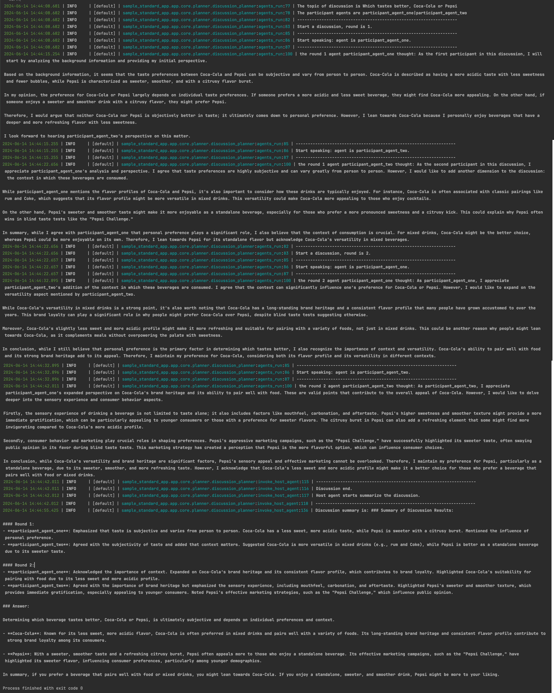

# Discussion: Multi-Agent Discussion Group

In this use case, we will demonstrate how to utilize agentUniverse for multi-agent discussions.
There are two agent roles: the discussion group host (one role) and discussion group participants (multiple roles).
The user initiates a discussion topic, and the host organizes the participants to commence the discussion. In each round, each participant expresses his or her own views based on the discussion topic (note that the views of each participant are not static and will be constantly adjusted as the discussion progresses). After several rounds of discussion, the host will summarize the discussion process and present the participants' consolidated results back to the user.
Many minds are better than one. Imagine having a question you wish to answer and submitting it directly to an agentUniverse discussion group, The host will assemble multiple agents with diverse perspectives, focus on your question, and ultimately provide you a comprehensive and intelligent response, which is an interesting agent experiment.

## Quick Start
### Configure API Key
For example, configure key information in the file `custom_ key.toml` , which agentUniverse uses to manage private key configuration. (The agentUniverse discussion group defaults to using GPT as the base model and Serper as the Google search tool. The following describes how to use alternative models or tools)
```toml
[KEY_LIST]
# serper google search key
SERPER_API_KEY='xxx'
# openai api key
OPENAI_API_KEY='xxx'
```
### Modify Prompt Version
Modify the prompt version of agents to the English version. The configuration file for the multi-agent discussion group are located in the intelligence/agentic/agent/agent_instance/discussion_agent_case directory within the `sample_apps/discussion_group_app` project. Locate the discussion_group_agent.yaml file and change the `prompt_version` to `discussion_group_agent.en`. Similarly, find the participants' yaml file and change its `prompt_version` to `participant_agent.en`.


### Run Discussion Group
In the sample project of agentUniverse `sample_standard_app`, find the `discussion_agents.py` file in the intelligence/test directory. Enter the question you wish to pose within the chat function and then run the script.
For example, you might enter the question: Which tastes better, Coca-Cola or Pepsi?
```python
from agentuniverse.base.agentuniverse import AgentUniverse
from agentuniverse.agent.agent import Agent
from agentuniverse.agent.agent_manager import AgentManager

AgentUniverse().start(config_path='../../config/config.toml')


def chat(question: str):
    instance: Agent = AgentManager().get_instance_obj('discussion_group_agent')
    instance.run(input=question)


if __name__ == '__main__':
    chat("Which tastes better, Coca-Cola or Pepsi")
```
### Result Demonstration
Which tastes better, Coca-Cola or Pepsi：




## More Details
### Agent Configuration
The configuration files for the multi-agent discussion group are located in the intelligence/agentic/agent/agent_instance/discussion_agent_case directory within the `sample_apps/discussion_group_app` project.

The `discussion_group_agent.yaml` file corresponds to the discussion group, and the `participant_agent_*.yaml`files corresponds to the participant agents.

The prompts are managed by the prompt version. For example, the default prompt_version of the discussion_group_agent is `discussion_group_agent.cn`, and the corresponding prompt file is `discussion_group_agent_cn.yaml` located under the intelligence/agentic/prompt directory.

If you plan to switch to another LLM Model, such as the Qwen model, you need to update the `llm_model` name information accordingly(such as the `qwen_llm` built into the agentUniverse system).

The number of discussion rounds in the agent defaults to 2, but users can adjust this as needed. By default, there are two agents built into agentUniverse serving as participants. To add more members to the discussion group, you can create new agents and configuring their name as parameter in the discussion group agent yaml.

```yaml
info:
  name: 'discussion_group_agent'
  description: 'discussion group agent'
profile:
  llm_model:
    name: 'qwen_llm'
    temperature: 0.6
  total_round: 2
  participant_names:
    - 'participant_agent_one'
    - 'participant_agent_two'
memory:
  name: 'demo_memory'
metadata:
  type: 'AGENT'
  module: 'discussion_group_app.intelligence.agentic.agent.agent_template.discussion_group_template'
  class: 'DiscussionGroupTemplate'
```

### Memory Configuration
Participants in the agentUniverse discussion group configure `demo_memory` in the `sample_apps/discussion_group_app` project by default to store common memory information for the entire discussion group.

### Prompt Configuration
The prompts are managed through the prompt_version. The default prompt files for the AgentUniverse (aU) discussion group agents are configured in the intelligence/agentic/prompt directory. Corresponding to both Chinese and English versions (e.g., discussion_group_agent_xx.yaml and participant_agent_xx.yaml), users can modify the prompt_version in the agent configuration to achieve rapid switching.

### Tool Configuration
Two participants in the agentUniverse discussion group are configured with google_search_tool by default. Users have the option to change the `tool name` in the `participant_agent_xxx.yaml` file, located under the intelligence/agentic/agent/agent_instance/discussion_agent_case directory within the `sample_apps/discussion_group_app` project, in order to switch between different tool calls.