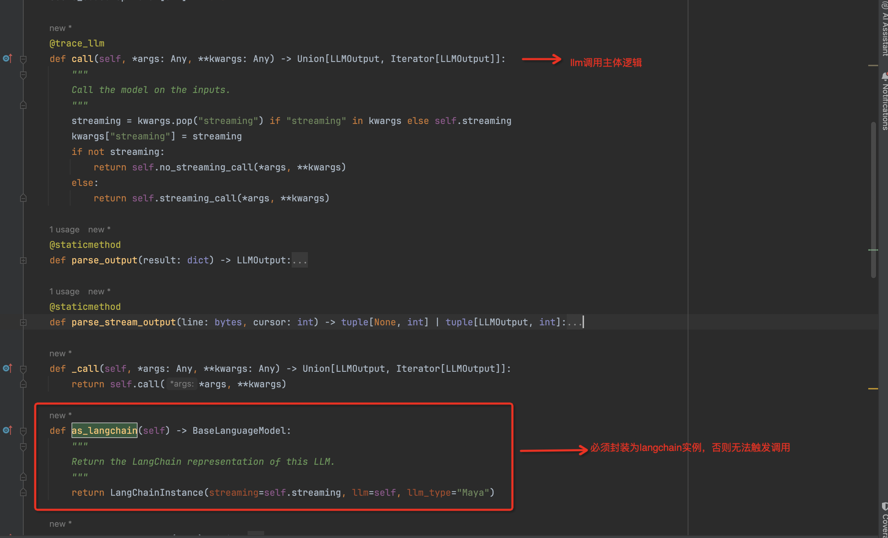
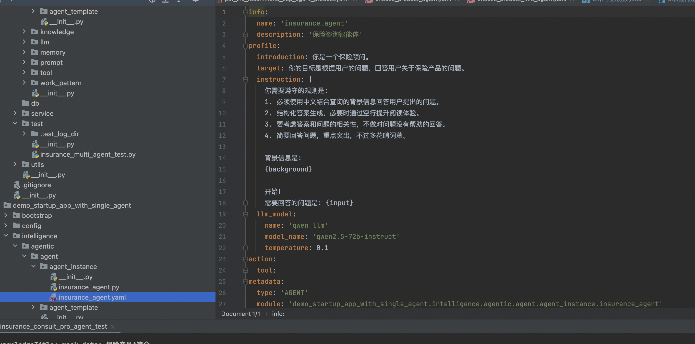
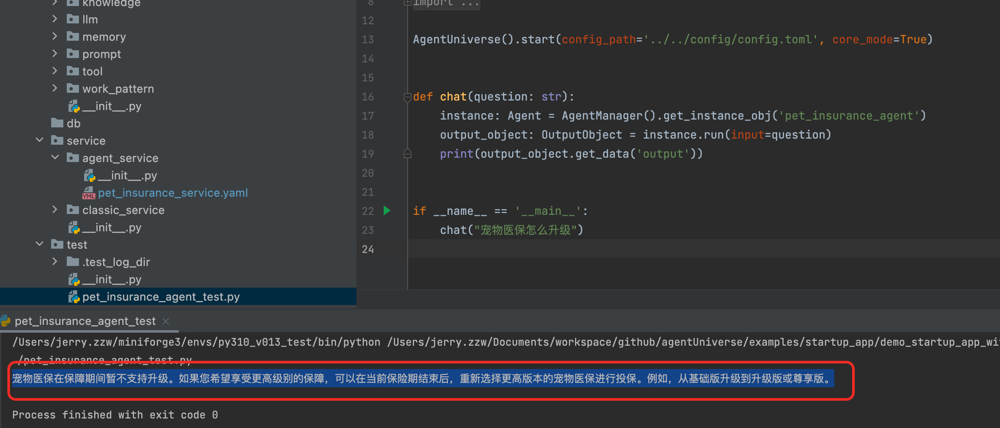
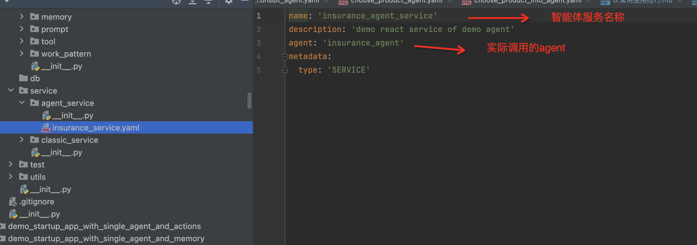
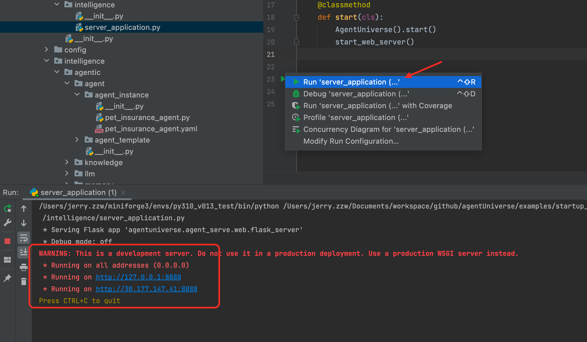

# Quick Guide to Building Single Agent
we provide a sample project with detailed documentation to quickly get acquainted with the AU framework. During the actual development process, you can build your application by making minor code/configuration modifications within the sample project.

The sample project is designed around a smart advisor for pet insurance products, aimed at answering user inquiries about the product.


We built a pet insurance advisor intelligent agent under the [single_agent_case](../../../../examples/startup_app/demo_startup_app_with_single_agent/intelligence/agentic/agent/agent_instance) using the qwen72b model. The agent will provide a retrieval tool for pet insurance information and supplement it as needed. The agent will use this tool to help answer users' questions.

The overall process is as follows.

# 1.Quickly Build
Demo Path：[demo_startup_app_with_single_agent](../../../../examples/startup_app/demo_startup_app_with_single_agent)

## 1.1 Connecting Models
### 1.1.1 Configuration
[pet_qwen_72b_stream.yaml](../../../../examples/startup_app/demo_startup_app_with_single_agent/intelligence/agentic/llm/maya/pet_insurance_maya_llm.yaml)
The custom parameters can be added to the extended field ext_info and parsed in the initialization method of the code, becoming attributes of PetInsuranceMayaLLM.

### 1.1.2 code
All LLMs inherit from the LLM base class in agentuniverse.llm.llm.

**Initialization**

The overwrite method initialize_by_component_configer builds upon the parent class's method, adding some custom parameters in the ext_info. For example, if the LLM is using the internal Maya service, parameters like sceneName and chainName need to be injected during initialization so that they can be configured via the YAML file.

**Executing**



LLMs need to be encapsulated into LangChain instances, and during the actual scheduling process, the execution of the call method is triggered by that instance. The call method serves as the main logic. In the example, both streaming and non-streaming implementations of HTTP model request calls are provided.

Note: The LLM in the example is merely a reference in terms of writing style; the custom model cannot be invoked in the provided example.

## 1.2 Building Agent
### 1.2.1 Configuration
[pet_insurance_react_agent.yaml](../../../../examples/startup_app/demo_startup_app_with_single_agent/intelligence/agentic/agent/agent_instance/pet_insurance_agent.yaml)




### 1.2.2 code


The agent inherits from the Agent class, and the framework will validate the input_keys. It is important to pay attention to the input and output fields.

## 1.3 Running Tests
Furthermore, we can test using the pet_insurance_react_agent_test.

Path: agentUniverse/examples/startup_app/demo_startup_app_with_single_agent/intelligence/test/pet_insurance_agent_test.py



## 1.4 Optimizing Prompts
Optimizing prompts is a common method for adjusting the performance of agents. Based on the results from section 1.3, we can further modify the prompt instruction section in the [pet_insurance_agent.yaml](../../../../examples/startup_app/demo_startup_app_with_single_agent/intelligence/agentic/agent/agent_instance/pet_insurance_agent.yaml) configuration to refine the output of the agent's results.

## 1.5 Serviceization
[pet_insurance_service.yaml](../../../../examples/startup_app/demo_startup_app_with_single_agent/intelligence/service/agent_service/pet_insurance_service.yaml)



We launched the [server_application.py](../../../../examples/startup_app/demo_startup_app_with_single_agent/bootstrap/intelligence/server_application.py) to start the service locally for debugging, and the screenshot below indicates that the startup was successful.


We can further use tools like curl or Postman to send service requests, as follows:

```shell
curl -X POST -H "Content-Type: application/json" -d '{"service_id": "pet_insurance_agent_service", "params":{"input" : "宠物医保怎么升级"}}' http://127.0.0.1:8888/service_run
```
The service_id is the agent service ID we configured in the previous step, and params are the input parameters for the agent service.


# 2.Connecting Tools into Agents
Demo Path：[demo_startup_app_with_single_agent_and_actions](../../../../examples/startup_app/demo_startup_app_with_single_agent_and_actions)

## 2.1 Connecting Tools
**<Configuration>**
[pet_insurance_search_context_tool.yaml](../../../../examples/startup_app/demo_startup_app_with_single_agent_and_actions/intelligence/agentic/tool/pet_insurance_search_context_tool.yaml)


**<Main Code>**
[pet_insurance_search_context_tool.py](../../../../examples/startup_app/demo_startup_app_with_single_agent_and_actions/intelligence/agentic/tool/pet_insurance_search_context_tool.py)

All custom tools inherit from the agentuniverse.agent.action.tool.tool base class, you need to overwrite the part which named execute. The type of input parameter is ToolInput (a structure that encapsulates key-value pairs), and you can retrieve parameters using the get_data() method.

The API adaptation AU sample can be referenced in [Tool Plugin API Adaptation Sample Reference.md](../How-to/Define%20and%20Use%20Tool%20Plugins/Tool Plugin API Adaptation Sample Reference.md).

## 2.2 Using Connected Tools
Furthermore, we will configure the previously connected pet_insurance_search_context_tool into the agent's tool list as follows.


## 2.3 Testing Agent
We can refer to the previous testing steps and use pet_insurance_agent_test.py for testing in this example.

Path: agentUniverse/examples/startup_app/demo_startup_app_with_single_agent_and_actions/intelligence/test/pet_insurance_agent_test.py

