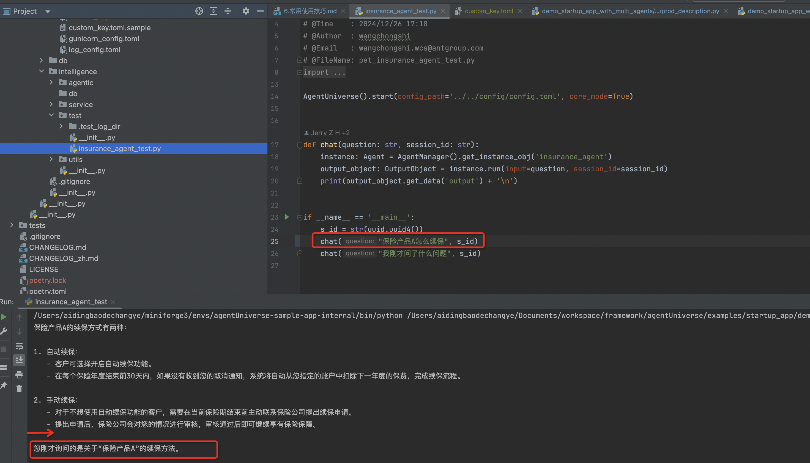

# Documentation Description  
In this example, we will further introduce how to incorporate a memory module into an intelligent agent.

# Adding a Memory Module to the Agent

During the use of the agent, we need to use the agent's memory capabilities. In the sample project, we have created a case that demonstrates the use of memory.

Demo Path: [demo_startup_app_with_single_agent_and_memory](../../../../examples/startup_app/demo_startup_app_with_single_agent_and_memory)

In the AU agent, the use of memory can also be configured. We can refer to the `memory` section in the configuration of the agent [insurance_agent](../../../../examples/startup_app/demo_startup_app_with_single_agent_and_memory/intelligence/agentic/agent/agent_instance/insurance_agent.yaml).

In this case, we have configured `demo_memory` as the memory instance type. We can further examine the specific configuration of this example in `demo_memory.yaml` (path: agentUniverse/examples/startup_app/demo_startup_app_with_single_agent_and_memory/intelligence/agentic/memory/demo_memory.yaml).

## Running Test
You can see the results of the agent with memory module by running the test in [insurance_agent_test.py](../../../../examples/startup_app/demo_startup_app_with_single_agent_and_memory/intelligence/test/insurance_agent_test.py).

