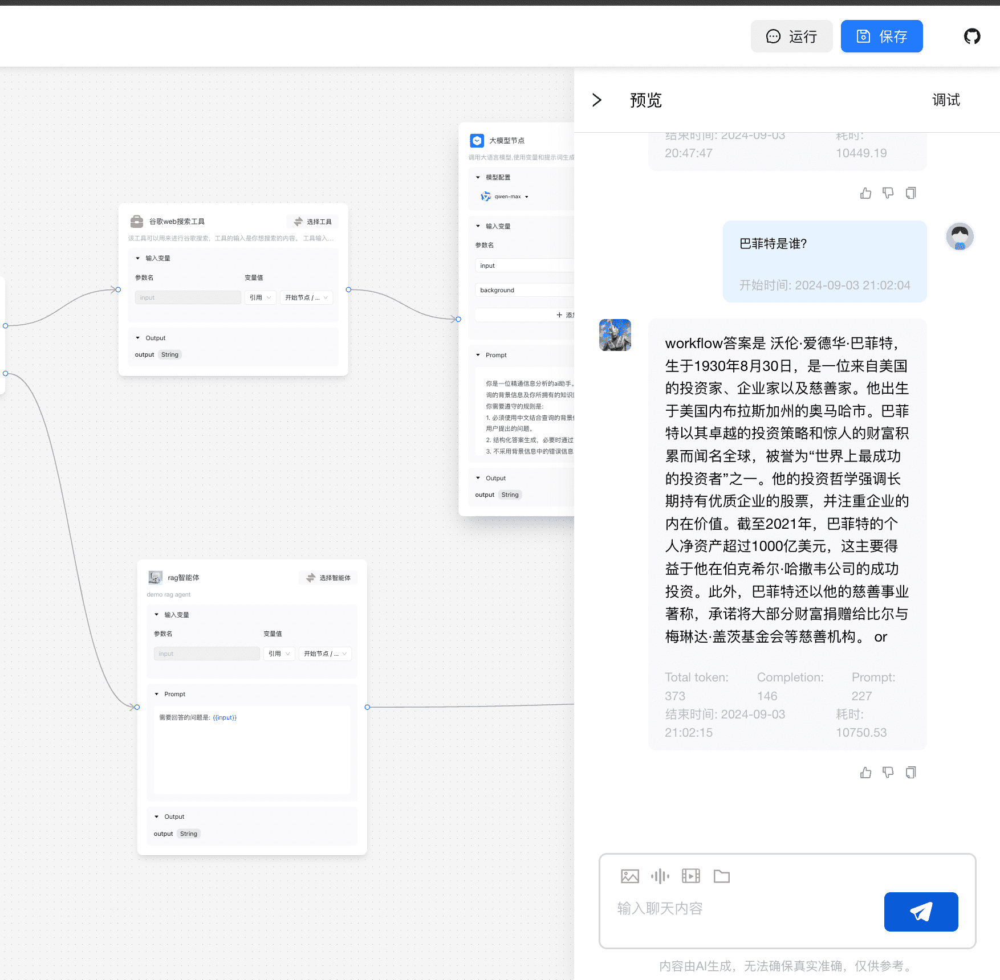
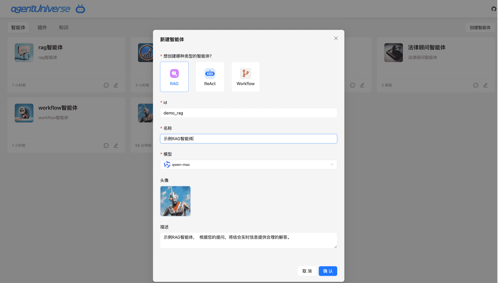
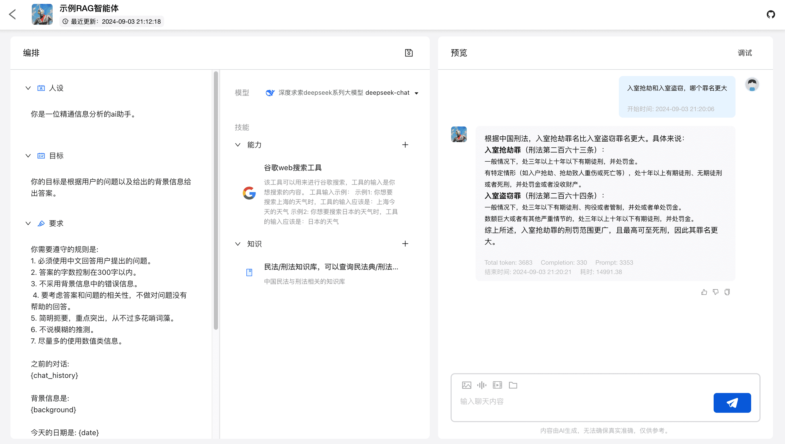
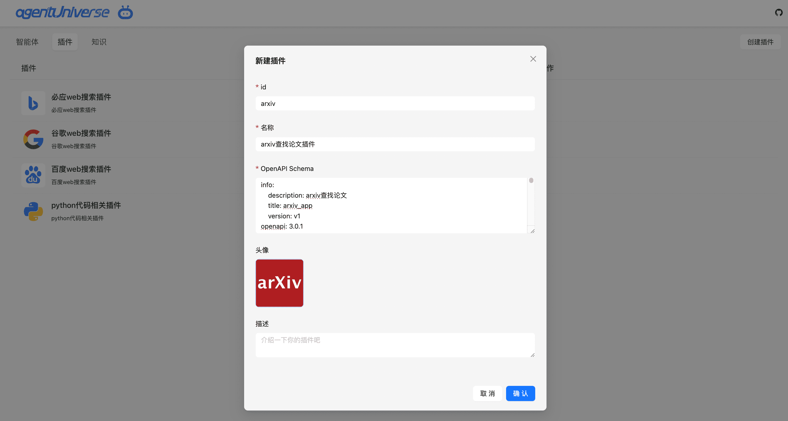

# Product Platform Advancement Guide
In this section, we will guide you on how to:
1. Utilize the Workflow Agent Orchestration Feature
2. Create a Table Form Agent Using the Feature
3. Insert Custom Knowledge Utilizing the Feature
4. Integrate Custom Plugins with the Feature


## Workflow Agent Orchestration Feature
``` text
Note: For old users of the agentUniverse productization platform orchestration capability, please upgrade the magent-ui package version to 0.1.17, and the corresponding aU version must not be lower than 0.0.13. You can use the following command for version-specific installation:

pip install magent-ui==0.1.17 ruamel.yaml --force-reinstall
```
### Create Workflow Agent
On the aU-product homepage, click the "Create Agent" button to the right of the agent tab, and select the workflow type agent.


### Workflow Node Type
The current agentUniverse product platform supports seven types of nodes, which are:
● Start Node: define the initial parameters for initiating a workflow process.
● Tool Node: provide third-party plugin capabilities to enhance the workflow.
● Knowledge Node: retrieve text content related to the user's query from the knowledge base, serving as context for downstream LLM nodes.
● LLM Node: invoke large language models to answer questions or process natural language inputs.
● Agent Node: invokes and executes existing agent applications within the workflow.
● If-else Node: split the workflow into multiple branches based on if/else conditional judgments.
● End Node: define the final output content upon completion of a workflow process.


### Workflow Agent Orchestration
On the canvas, connect various types of workflow nodes to construct a complete workflow process.
Click the Save button, and agentUniverse will automatically generate the corresponding workflow and agent YAML files locally, aiding users in completing their development tasks.

``` text
Note: Please ensure that the logic for passing parameters between nodes is correct; otherwise, it will cause the workflow to fail.
```

The complete workflow process is illustrated in the following figure:


The agent configuration file generated by agentUniverse is depicted in the following figure:


### Run Workflow Agent
After clicking the save button, start attempting to run the workflow agent.
The operation process is as shown in the figure:



## Table Form Agent Creation Feature
### Create Table Form Agent
On the product homepage, click the 'Create Agent' button to the right of the agent tab, and then select either the RAG or ReAct type agent.

agentUniverse will automatically generate the corresponding agent YAML file locally, thereby assisting users in completing their development tasks.



### Run Agent
After clicking the save button, proceed to attempt running the created example RAG agent.
The operational process is illustrated in the figure below:


## Custom Knowledge Insertion Feature
### Create Custom Knowledge
On the product homepage, naviagte to the Knowledge tab, and click the 'Add Knowledge' button located to the right to create a custom knowledge base.

agentUniverse will automatically generate the corresponding knowledge and storage YAML files locally, thereby assisting users in completing their development tasks.


### Upload Knowledge
Specify the knowledge base, then click the upload button to upload the local knowledge file.
Once the upload is successful, you can utilize the corresponding knowledge base within the knowledge node of the workflow agent or the knowledge module of the table form agent to retrieve content pertinent to user inquiries.

```text
Currently supported knowledge types are: pdf/docx/pptx/txt
```
The upload operation process is illustrated in the figure below:


## Custom Plugin Insertion Feature
### Create Custom Plugin
On the product homepage, navigate to the Plugin tab, and click the 'Create Plugin' button located to the right to create a custom plugin.


Once created successfully, you can utilize the corresponding tools within the tool nodes of the workflow agent or the tool modules of the table form agent. These tools provide powerful third-party plugin capabilities to enhance the agent's functionality.

Plugin schema example reference document: [schema](https://openai.xiniushu.com/docs/plugins/examples)

## More
The agentUniverse product platform is continuously iterating, and in the future, more convenient and useful features will be available for community users to experience. We also welcome your valuable suggestions and feedback.
This feature is jointly launched by [difizen](https://github.com/difizen/magent) and agentUniverse.
Let’s explore and progress together!