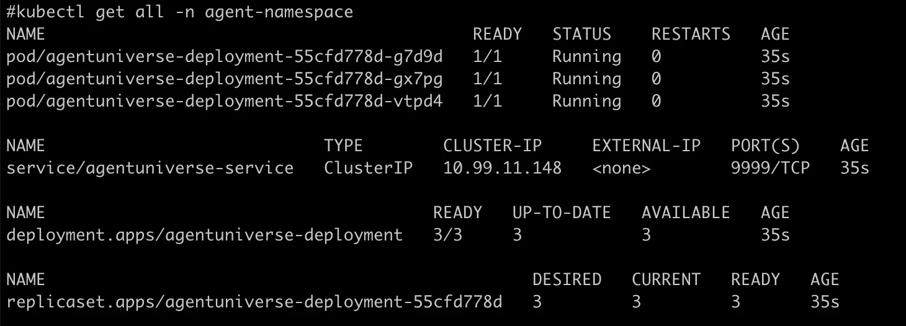

# High Availability Deployment with K8S
AgentUniverse provides standard working environment images, designed to support containerized deployments on Kubernetes (K8S) clusters. This guide will show you how to utilize these working environment images to deploy and set up a cluster on K8S. You can get full tag list in [this site](https://cr.console.aliyun.com/repository/cn-hangzhou/agent_universe/agent_universe/images).
Official K8S Documentation: [Kubernetes Setup Documentation](https://kubernetes.io/docs/setup/)

## 1. Resource Configuration
First, you need to configure the necessary resource files. Below is an example used to define the required Namespace, Deployment, and Service resources using a YAML configuration file:

```yaml
apiVersion: v1
kind: Namespace
metadata:
  name: agent-namespace
---
apiVersion: apps/v1
kind: Deployment
metadata:
  name: agentuniverse-deployment
  namespace: agent-namespace
  labels:
    app: agentuniverse
spec:
  replicas: 3
  selector:
    matchLabels:
      app: agentuniverse
  template:
    metadata:
      labels:
        app: agentuniverse
    spec:
      containers:
      - name: agentuniverse-container
        image: registry.cn-hangzhou.aliyuncs.com/agent_universe/agent_universe:0.0.9_centos8
        ports:
        - containerPort: 8888
        command: ["/bin/bash", "-c"]
        args: ["git clone git@github.com:antgroup/agentUniverse.git; mv agentUniverse/sample_standard_app /usr/local/etc/workspace/project; /bin/bash --login /usr/local/etc/workspace/shell/start.sh"]
        # Uncomment and replace "XXX" with your key to configure the agent
        # env:
        # - name: OPENAI_API_KEY
        #   value: "XXX"
---
apiVersion: v1
kind: Service
metadata:
  name: agentuniverse-service
  namespace: agent-namespace
spec:
  selector:
    app: agentuniverse
  ports:
  - protocol: TCP
    port: 9999
    targetPort: 8888
```

### 1.1 Setting Environment Variables for AgentUniverse Project

#### Method 1 (Recommended)

In the resource configuration file, uncomment the `env` section and replace `value` with your key. For additional security considerations, it's recommended to use K8S officially recommended methods, such as ConfigMap. See the [ConfigMap Configuration Documentation](https://kubernetes.io/docs/tasks/configure-pod-container/configure-pod-configmap/).

#### Method 2

Please refer to the description at the beginning of the configuration file: [Quick Start Guide](../../../Get_Start/Quick_Start.md)

## 2. Building Resources

Create and apply the aforementioned configuration file:

```
kubectl apply -f agentuniverse.yaml
```

## 3. Verifying Resources

Verify that all resources have been correctly deployed:

```
kubectl get all -n agent-namespace
```



## 4. Accessing AgentUniverse Services from Inside the Cluster

To access AgentUniverse services from within the cluster, use the following command line example:

```
kubectl exec -it [Pod Name] -n agent-namespace -- curl http://agentuniverse-service:9999
```

### 4.1 Examples

#### 4.1.1 Connectivity Test

```
kubectl exec -it agentuniverse-deployment-55cfd778d-g7d9d -n agent-namespace -- curl http://agentuniverse-service:9999/echo
```


#### 4.1.2 Q&A Test

```
kubectl exec -it agentuniverse-deployment-55cfd778d-g7d9d -n agent-namespace -- curl -X POST -H "Content-Type: application/json" -d '{"service_id":"demo_service","params":{"input":"(18+3-5)/2*4=?"}}' http://agentuniverse-service:9999/service_run
```


