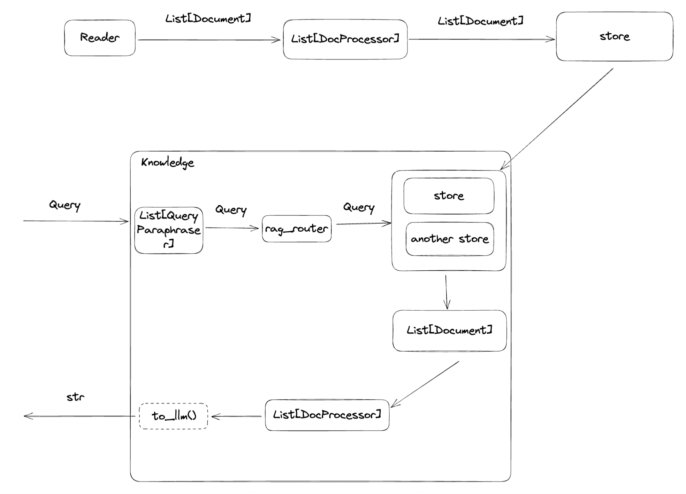

# 知识(Knowledge)
数据、信息、知识，当这几个词同时出现时往往容易混淆含义，简单来说这三个词有着层层递进的关系，知识的抽象程度最高，对于内容有很强的稳定性与可靠性要求。

我们都知道无论是传统的机器学习模型还是大语言模型在训练的过程中都需要大量的数据，我们总是希望这些数据是高质量与可靠的。尽管现有的许多大语言模型在面向用户时已经包含了非常惊人的数据与指令集合，但是就同人是不可能变得全知全能一样，大语言模型往往也拥着"知识"盲区。

通过额外加载的知识内容，Agent可以学习与掌握原本其LLM并不擅长的知识部分，同人类学习知识一样，Agent通过这一方式让自己变得更加有知。

agentUniverse定义了标准的知识定义，其包含了各类知识数据的加载方式，也包含了去连接那些各种各样的知识存储，您可以将任何任何形式的知识数据定义成标准的知识组件供agent与其他组件使用。

## 知识架构
agentUniverse中，知识的整体架构图如下所示：

其中上半部分从Reader到Store为知识的注入流程，而下半部分为知识的查询流程。

### 知识注入流程

在知识注入流程中，通过`Reader`读取原始的数据转化为agentUniverse内部`Document`的形式，`Document`可以包含文本、图像、向量等等中的一种或多种内容，也可以继承该类型自定义拓展为更多的形式，如音频、视频。在此之后，`DocProcessor`会对`Document`进行一系列的处理操作, 如图上所示，`DocProcessor`的输入与输出均为Document，意味着您可以在这一过程中叠加使用多个不同的`DocProcessor`。最后，经过处理的`Document`会被存储至不同的`Store`中，`Store`可以是任意的数据存储方式，包括但不限于：关系型数据库、向量数据库、图数据库。因此同一份`Document`可以在不同的`Store`中保存为不同的形式，但他们的元信息中会包含相同的id，表示它们来源于同一个`Document`,用于在后续查询时避免召回相同的内容。

### 知识查询流程
在查询知识时，用户需要构建一个`Query`。类似`Document`,`Query`的内容也可以是多样的：从简单的字符串，到向量、图像都可以——只要知识包含的`Store`支持这样的查询方式。在传入`Knowledge`组件后，和`DocProcessor`相似，`QueryParaphraser`用于对`Query`进行处理，您可以对原始查询字符串提取关键词用于查询包含特定tag的段落，也可以将原始查询问题拆分为多个更易于查询的子问题，等等。在此之后，`RagRouter`组件会负责将`Query`与合适的`Store`进行配对，生成多个[Query, Store]的查询任务，这种配对可以是基于LLM对于查询文本和`Store`描述匹配程度的理解，也可以是基于特定规则选取特定的`Store`，如果资源允许，也可以直接在所有`Store`上进行查询。`Store`查询返回的内容依旧是`Document`类型，因此在后续流程中我们依旧可以使用`DocProcessor`对召回的`Document`进行一系列后处理的流程，不同之处在于，此时`Query`也会作为默认参数传递给`DocProcessor`，因此在该阶段可以对召回的`Document`进行类似Rerank等需要比较召回内容和Query内容的处理。最后，您还可以通过默认或是自定义的to_llm方法将召回的`Document`转为方便llm理解的字符串形式，作为最终的输出。

# 总结
至此您已初步了解知识组件的设计原理，在下一节我们将具体向您介绍知识组件的标准定义、如何自定义创建知识、如何使用知识等。
