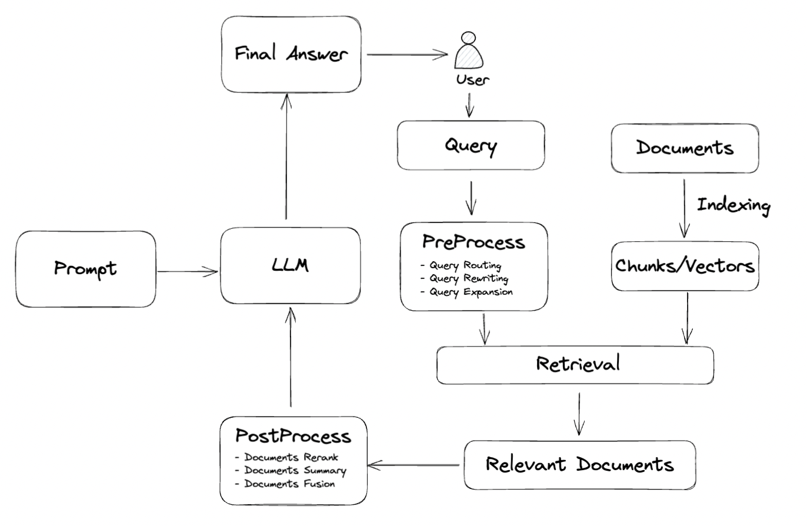

# RAG

Retrieval-Augmented Generation (RAG) 是一种前沿的自然语言处理（NLP）技术，通过结合信息检索和生成模型，显著提升了文本生成任务的准确性和多样性。RAG 的核心思想在于，在生成文本之前，先从大规模文档库中检索出与输入查询最相关的内容，并将这些检索到的信息作为上下文，传递给生成模型。这样，生成模型不仅仅依赖于训练数据，还可以动态获取最新的外部知识，从而让智能体生成更加符合语境的响应。

## 通用RAG流程

参考[这篇综述](https://arxiv.org/pdf/2312.10997)，我们可以将现在大多数的RAG流程概括为三个部分：
1. 文档的索引构建：从原始的大规模文档库中的Documents构建出便于检索召回的形式，一般是将文本拆分为小段的chunks后通过embedding转为向量索引的形式存储在向量数据库中。
2. 相关知识的检索：用户在提供Query后，根据Query的内容从第一步中的文档索引里找出相关的一批文档。这个过程会涉及到对原始Query的改写（使得Query能召回更相关的内容）、文档的重排序（从大量召回内容里选取更加相关的一小部分）等步骤，但所有步骤的目的都是为了筛选出和原始Query最相关的文档内容。
3. 最终结果的生成：这一步需要将步骤2中召回的文档送入大模型，结合提示词和原始Query的内容，生成最后的回答。

## agentUniverse中的RAG
对比上述的通用RAG流程，agentUniverse将RAG拆分为了两部分：
1. 知识组件：包含从文档构建知识库以及根据Query检索知识的能力。您可以参考[知识](./知识/知识.md)了解详细的使用方式。
2. 智能体利用知识生成回答：在第一步构建完成知识组件后，智能体可以利用知识组件召回和Query相关的文档，和提示词以及上下文一同传递给大模型，生成最终的回答。具体使用方法您可以参考[智能体创建与使用](./智能体/智能体创建与使用.md)中的内容在agent的action下的knowledge中设置您创建的任意知识。

如果您想快速利用自己的文档构建RAG流程并在智能体中使用的话，您可以参考[如何构建基于知识的RAG智能体](../../How-to/构建与使用知识库/如何构建RAG智能体.md)。

