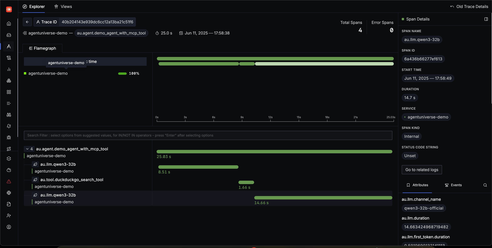
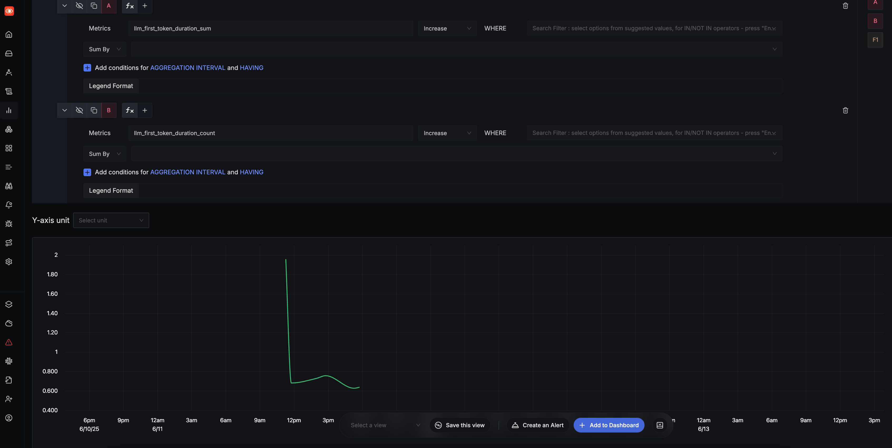

# 基于OpenTelemetry可观测能力

本文档介绍 agentUniverse 项目中基于 OpenTelemetry 的可观测性功能，包括 TelemetryManager 核心管理类以及agentUniverse中特有的OTel扩展组件。

## 概述

在agentUniverse中，我们通过TelemetryManager实现基于OpenTelemetry 的跟踪（Trace）和指标（Metric）采集。用户可以在配置文件`config.toml`中对OTel相关功能进行定制化配置。agentUniverse提供了基于LLM、Tool以及Agent维度的Instrument，方便用户追踪智能体全生命周期。

## 核心组件

### 1. TelemetryManager

[代码链接](../../../../../../agentuniverse/base/tracing/otel/telemetry_manager.py)

主要的管理类，负责初始化和配置整个 OpenTelemetry。它负责从`config.toml`中读取相关配置，并初始化Tracer以及Metrics。支持配置自定义Resource，Provider类，可自行添加多种SpanProcessor, Metric Reader以及Instrument。详细的配置方法和推荐配置请参考[推荐配置](推荐配置.md)。

### 2.Instruments

agentUniverse中提供了三种Instrument，分别基于LLM、Tool以及Agent维度。您可以通过[推荐配置](推荐配置.md)的方法按照您的实际需求添加不同的Instrument。具体的Span属性和指标类型您可以在对应Instrument的文档中查阅：
- [LLM_Instrument](./LLM_Instrument.md)
- [Tool_Instrument](./Tool_Instrument.md)
- [Agent_Instrument](./Agent_Instrument.md)


### 3. SessionSpanProcessor

[代码链接](../../../../../../agentuniverse/base/tracing/otel/span_processor/session_span_processor.py)

自定义的 Span 处理器，用于在每个 Span 中注入会话 ID 信息。默认开启OTel后会注册，无需另外配置。

#### 功能特点

- 在 Span 开始时自动添加Sessison ID 属性，属性名为`au.trace.session.id`
- 如果没有会话 ID，则设置为 `-1`

### 4. AUSessionPropagator

[代码链接](../../../../../../agentuniverse/base/tracing/otel/span_processor/session_span_processor.py)

自定义的上下文传播器，用于在不同服务间传播会话信息。默认开启OTel后会注册，无需另外配置。

#### 功能特点

- 上下游应用可以根据OTel中Baggage内的特定字段传播aU体系下的session Id。Baggage中的字段为`AU-SessionId`和`auSessionId`(两者值相同)。


## 实践案例

在实际部署中，您可以通过不同的Exporter将Trace和Metric数据上送到不同的可观测平台，如Jaeger、Prometheus等，从而可视化这些内容。本节介绍如何在本地通过Signoz对智能体进行观测。

Signoz 是一个开源的可观测性平台，支持指标、日志和追踪的统一分析，基于 OpenTelemetry 构建，支持自部署，适合开发者监控微服务应用。官网地址：https://signoz.io。

### 1. 部署Signoz
本地部署 Signoz 很简单，可以直接使用官方提供的部署脚本：
```shell
git clone https://github.com/SigNoz/signoz.git
cd signoz/deploy/
chmod +x install.sh
./install.sh
```

### 2. 在agentUniverse应用中配置OTel设置
配置如下，通过`OTLPSpanExporter`和`OTLPMetricExporter`分别将Trace和Metrics通过http接口上送至Signoz。
```toml
[OTEL]
service_name = "agentuniverse-demo"

# 自定义Provider配置（可选，使用默认的TracerProvider）
provider_class = "opentelemetry.sdk.trace.TracerProvider"
id_generator_class = "opentelemetry.sdk.trace.RandomIdGenerator"

# Instrumentation配置列表
instrumentations = [
  # AgentUniverse instrumentation
  "agentuniverse.base.tracing.otel.instrumentation.llm.llm_instrumentor.LLMInstrumentor",
  "agentuniverse.base.tracing.otel.instrumentation.agent.agent_instrumentor.AgentInstrumentor",
  "agentuniverse.base.tracing.otel.instrumentation.tool.tool_instrumentor.ToolInstrumentor",
]

# 资源配置 - 用于标识服务的元数据
[OTEL.resource]
deployment = "development"
version = "1.0.0"
environment = "dev"

# Processor配置 - 使用Console exporter输出到标准控制台
[[OTEL.processors]]
class = "opentelemetry.sdk.trace.export.BatchSpanProcessor"

  # Console exporter配置
  [OTEL.processors.exporter]
  class = "opentelemetry.exporter.otlp.proto.http.trace_exporter.OTLPSpanExporter"

    [OTEL.processors.exporter.args]
    endpoint = "http://localhost:4318/v1/traces"

[[OTEL.metric_readers]]
class = "opentelemetry.sdk.metrics.export.PeriodicExportingMetricReader"

  [OTEL.metric_readers.args]
  export_interval_millis = 1000

  # ── Metric Exporter
  [OTEL.metric_readers.exporter]
  class = "opentelemetry.exporter.otlp.proto.http.metric_exporter.OTLPMetricExporter"

    [OTEL.metric_readers.exporter.args]
    endpoint = "http://localhost:4318/v1/metrics"
```

### 3. 运行智能体服务

然后您可以运行任意的智能体服务，从而上送数据

### 4. 观测结果

Signoz的本地默认访问页面为localhost:8080
您可以在左边页面对应的Trace和Metrics中查看上送的结果。

#### Trace


#### Metrics


