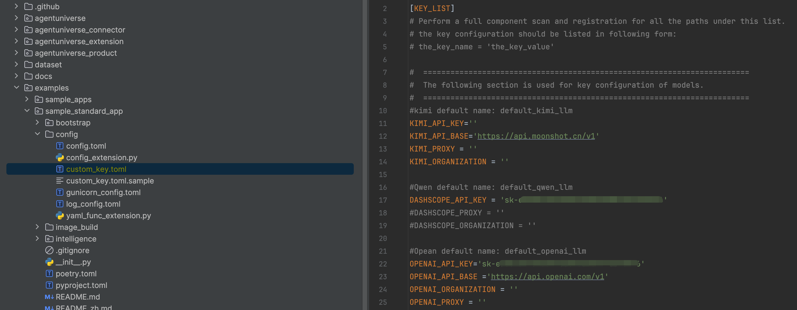
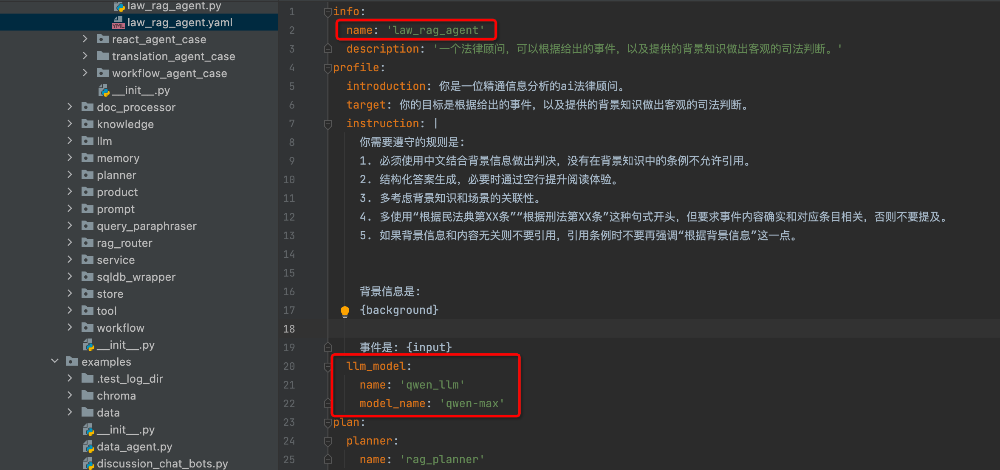
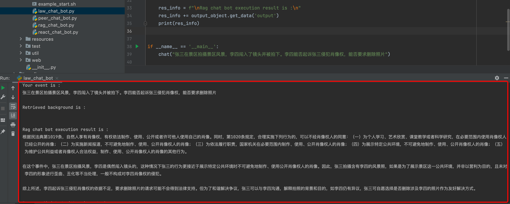

# 运行第一个教程案例
通过本文档，您将了解到如何快速运行agentUniverse的示例，并亲身体验其效果。

## 1.准备工作
在正式运行示例案例之前，需要确保您安装了必要的运行环境与工程准备。若您已经完成环境配置请跳过该部分。

### 1.1 环境准备
agentUniverse支持 `macos`、`linux`、`windows`3个系统平台，不同的系统平台环境配置细节会略有不同，这里我们不展开罗列，可以根据文档提供的必要步骤检查是否满足所有，并自行根据系统平台搜索对应软件配置教程。

#### 1.1.1 python环境准备
使用 **python 3.10** 版本

Tips: 如果您的电脑已经安装其他python版本环境，强烈建议您使用conda等python环境管理工具隔离出不同的多版本python环境。

#### 1.1.2 开发工具准备
agentUniverse是面向标准容器化交付的，包含标准镜像，您可以通过shell运行和修改源代码用于研发阶段，但是这种方式效率不高。

尽管本部分不是必须的，但是我们强烈建议您安装一个面向python的IDE工具。结合python的研发体验我们推荐使用pycharm，其次是vscode（vs面向python研发配置会麻烦些，不建议python研发初学者使用）。

不要忘了在对应的IDE工具配置python interpreter。

### 1.2 工程准备
#### 1.2.1 样例工程准备
您可以在项目门户网页中或使用`git clone`下载agentUniverse源代码。

完成本部分操作您会获得如下的工程结构，其中源码中的`sample_standard_app`文件夹为样例工程代码，该文件夹位于根目录下一级，根目录为`agentUniverse`。

#### 1.2.2 安装对应的框架包
```shell
# 框架包
pip install agentUniverse

# 产品可视化界面包(按需安装)
pip install magent-ui ruamel.yaml
```

#### 1.2.3 密钥配置
本框架支持通过环境变量、文件配置等方式注入密钥，我们在密钥设置的单独章节会说明完整用法，这里我们展示文件配置密钥的步骤。请严格按顺序检查下列步骤是否满足：

##### step1. 确认config文件开启自动读取外置密钥文件
找到项目工程中的主配置文件（路径为：agentUniverse/sample_standard_app/config/config.toml）；找到 SUB_CONFIG_PATH 配置项下的 custom_key_path 配置项，将其注释放开如下图:


这一步将开启项目自动读取配置文件批量加载密钥的能力，我们可以看到 custom_key_path 配置项已经默认包含了1个路径，为了简化教程在这里我们暂不修改路径。

##### step2. 根据模版创建外置密钥文件
外置密钥文件模版在config的同层级路径（具体路径为sample_standard_app/config/custom_key.toml.sample），我们将 custom_key.toml.sample 拷贝并且创建一个新文件，结合step1中custom_key_path的默认配置命名为 custom_key.toml，如下图：


Tips: 外置密钥文件一般包含了您的所有ak，这是非常私密且需要严格保护的，这个文件是绝对不允许被泄漏或者被git这类代码平台管理的。在实际的生产项目中，我们通常会将该文件剥离出项目外，并且加上一个系统级别的强权限管控，本框架的密钥配置之所以会有这些步骤更多的是出于生产安全性的考虑。

##### step3. 在外置密钥文件中配置您的常用模型ak
密钥文件已包含了数十种常见的模型服务ak格式，你可以根据自身需求填写自己的密钥，别忘了放开注释。

后续的教程中，我们将以千问与GPT模型作为教程agent使用的llm，所以这里我们以千问、GPT为例配置对应的ak如下图：


## 2. 运行第一个案例
agentUniverse已经包含了若干官方教程案例，路径在 agentUniverse/examples/sample_standard_solutions

在本节我们来运行第一个案例，我们选取 law_chat_bot 作为第一个教程案例。

### 2.1 确定example背后使用的agent与其配置
以 legal_advice_rag_agent 为例（路径：agentUniverse/examples/sample_standard_solutions/rag_app/intelligence/test/legal_advice_rag_agent.py），我们先在脚本中找到对应的agent_name, 以law_chat_bot为例law_rag_agent。


确定example使用的agent后，我们到项目agent目录（目录路径为：agentUniverse/sample_standard_app/app/core/agent）下找到对应的agent配置 law_rag_agent.yaml，注意agent配置中的name项即为law_chat_bot中的agent名称


我们进一步查看 law_rag_agent.yaml 中的其他配置详情，在这里请进一步关注 llm_model 这一个配置项，这一项为配置选择agent所使用的llm，law_rag_agent 中默认使用了 qwen系列的qwen-max 作为模型内核，若您在密钥配置阶段配置的为其他系列模型类型需要在这里替换，对应常用模型替换参考如下。默认复制即可，model_name有需要可以自行按照服务商官方模型code替换。

千问系列
```text
  llm_model:
    name: 'qwen_llm'
    model_name: 'qwen-max'
```

gpt系列
```text
  llm_model:
    name: 'demo_llm'
    model_name: 'gpt-4o'
```

文心系列
```text
  llm_model:
    name: 'wenxin_llm'
    model_name: 'ERNIE-3.5-8K'
```

kimi系列
```text
  llm_model:
    name: 'kimi_llm'
    model_name: 'moonshot-v1-8k'
```

百川系列
```text
  llm_model:
    name: 'baichuan_llm'
    model_name: 'Baichuan2-Turbo'
```

DeepSeek系列
```text
  llm_model:
    name: 'deep_seek_llm'
    model_name: 'deepseek-chat'
```

Tips：为简化配置过程，这里我们只列举了部分常用模型服务，此外除了模型服务商、本地部署模型均可配置，我们在这个章节不演示，有这部分需求的用户可以进一步关注llm配置相关的章节。


### 2.2 运行案例
通过上述的步骤，您已经完成了所有前置工作，让我们来直接运行看一看效果。找到agentUniverse/sample_standard_app/app/examples/law_chat_bot.py文件，在ide或在shell中运行。


当你看到如下结果时说明案例已经跑通了。




## 3. 其他案例的运行
至此你已经完成了第一个案例的运行，在其他官方案例中我们使用了 google_search_tool 这个工具，这将给您的agent提供网络检索能力，为了体验其他用例我们建议您申请serper并提前在密钥部分内置搜索工具的ak，serper官方已经提供上千次的免费检索额度用于您的体验。

你需要在serper官网申请SERPER_API_KEY并配置，官网地址： https://serper.dev

申请完成后，在密钥配置文件 custom_key.toml 中找到对应的key填写，并放开注释如下：

```toml
#Google search
SERPER_API_KEY='xxxxxx'
```

按照第2部分的步骤执行其他案例即可，现在您可以运行所有官方案例了。
