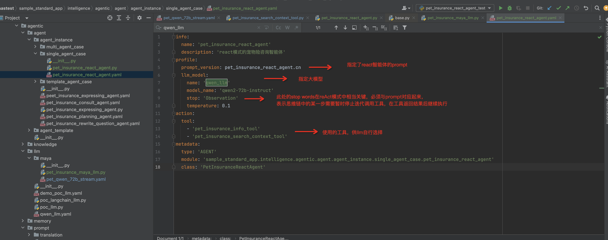
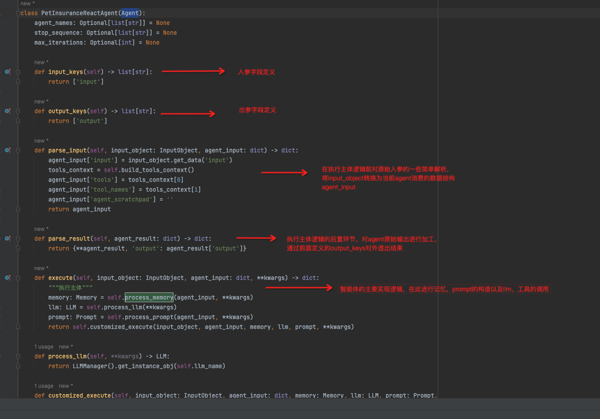
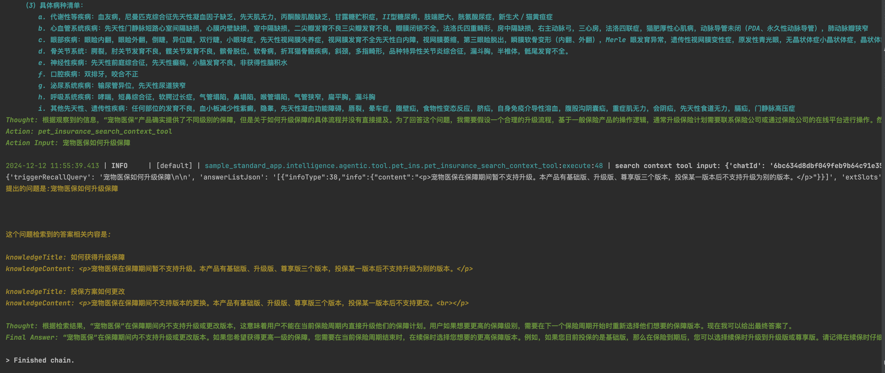
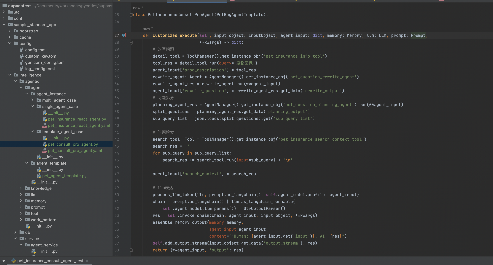

# 文档说明
为了让大家快速上手AU框架，我们提供了样板工程（可以直接运行）并配套详细的文字说明，在实际研发过程中直接基于其中的某些智能体结合自己业务进行一小部分代码/配置改写即可完成应用的搭建。

# 快速构建单体智能体
样板工程地址：[demo_startup_app_with_single_agent](../../../../examples/startup_app/demo_startup_app_with_single_agent)

样板工程拟定了业务是关于宠物险产品的智能顾问，对用户提出的产品问题进行解答。

[single_agent_case](../../../../examples/startup_app/demo_startup_app_with_single_agent/intelligence/agentic/agent/agent_instance)下构建一个宠物险顾问智能体，使用qwen72b模型，提供宠物医保的检索以及信息补充工具，react模式自行让模型选择工具帮助回答用户的问题。

从0开始搭建的整体流程如下：

## 构建agent所依赖的必须步骤
### 构建llm
#### 配置封装
[pet_qwen_72b_stream.yaml](../../../../examples/startup_app/demo_startup_app_with_single_agent/intelligence/agentic/llm/maya/pet_qwen_72b_stream.yaml)
拓展字段ext_info中可以添加自定义参数，并在代码初始化方法中解析，成为PetInsuranceMayaLLM的属性。

#### 代码实现
所有的llm都继承自agentuniverse.llm.llm的LLM基类。

**初始化**

overwrite方法initialize_by_component_configer，基于父类的方法，在ext_info中添加一些自定义参数。如llm走的是企业内部maya服务，需要sceneName，chainName等参数，在初始化中注入之后就可以通过在yaml中配置生效。

**执行主体逻辑**

llm需要封装成langchain实例，实际调度过程中由该实例唤起执行call方法。call方法为主体逻辑，在样例中对流式和非流式分别实现了http的模型请求调用。

注意：样例中的llm仅仅是写法上的参考，我们不提供真实模型调用。

### 构建tool
**<配置封装>**
[pet_insurance_search_context_tool.yaml](../../../../examples/startup_app/demo_startup_app_with_single_agent/intelligence/agentic/tool/pet_insurance_search_context_tool.yaml)

**<代码实现>**
[pet_insurance_search_context_tool.py](../../../../examples/startup_app/demo_startup_app_with_single_agent/intelligence/agentic/tool/pet_insurance_search_context_tool.py)

所有的自定义工具都都继承自agentuniverse.agent.action.tool.tool的Tool基类，核心执行方法为execute（你需要overwrite的地方），入参类型为ToolInput（key-value经过封装后的结构），通过get_data()方法获取参数。

API适配AU样例可参考 [自定义接入工具插件.md](../How-to/定义与使用工具插件/自定义接入工具插件.md)

### 构建知识
[//]: # (todo 新增中)

## 构建智能体
#### 配置封装
[pet_insurance_react_agent.yaml](../../../../examples/startup_app/demo_startup_app_with_single_agent/intelligence/agentic/agent/agent_instance/pet_insurance_react_agent.yaml)

该智能体依赖的prompt定义 [pet_insurance_react_prompt.yaml](../../../../examples/startup_app/demo_startup_app_with_single_agent/intelligence/agentic/prompt/pet_insurance_react_prompt.yaml)

react模式完全依赖llm自行思考问题，选择工具调度组装结果，在实际使用过程中需要注意思维链的迭代，尤其是停止词stop的配置（一般为Observation），不同模型对prompt需要进行微调去适配。

#### 代码实现

智能体继承Agent类，框架会对input_keys进行校验，一定要注意输入和输出字段。

上图示例是一个react智能体，执行主体execute方法中依次对memory，token，llm，tool加工处理后基于langchain构建了reAct实例，该实例通过invoke方法唤起。

## 运行测试

能看到这个思维链是先去调用pet_insurance_info_tool来获取“宠物医保”的详细信息，再去使用pet_insurance_search_context_tool尝试找到关于升级流程的直接信息。

最终的回答为: “宠物医保”在保障期间内不支持升级或更改版本。如果您希望获得更高一级的保障，您需要在当前保险周期结束时，在续保时选择您想要的更高保障版本。例如，如果您目前投保的是基础版，那么在保险到期后，您可以选择续保时升级到升级版或尊享版。请记得在续保时仔细阅读条款，以确保您了解新版本的所有细节和费用。

## 效果微调-优化prompt
优化prompt是调整智能体效果的常用手段。2.3中运行结果的表达相对啰嗦和重复，希望在表达上能够更精简，我们可以适当修改pet_insurance_react_agent.cn，优化llm的结果输出。

运行后的效果如下，对比2.3要好些。

## 服务化
[pet_insurance_react_service.yaml](../../../../examples/startup_app/demo_startup_app_with_single_agent/intelligence/service/agent_service/pet_insurance_react_service.yaml)

本地起服务调试，构建下面的请求

# 封装智能体模版
在上面的多智能体应用中我们会发现，三个智能体在实现上有很多相同的逻辑，甚至策划智能体继承自改写智能体。为了提升智能体的复用性，我们可以抽象出一些通用的逻辑和方法，封装成一个智能体模版AgentTemplate。大部分智能体构建仅需基于这个模版做一些微小的调整，甚至只是yaml配置的改动。

参考 [pet_agent_template.py](../../../../examples/startup_app/demo_startup_app_with_single_agent/intelligence/agentic/agent/agent_template/pet_agent_template.py)，这里将智能体会用到的包括注册agent，处理记忆/llm/工具/prompt以及执行主体的一些通用方法进行了一定的抽象，这些方法在宠物险的智能体中大部分都可以复用。以主智能体为例，只要overwrite方法customized_execute对主流程部分逻辑进行定制化即可。

实际上AU框架提供了相当多的[智能体模版](../../../../agentuniverse/agent/template)，包括Rag，React，PEER模式等，建议使用这些现有的模版构建自己的智能体。
