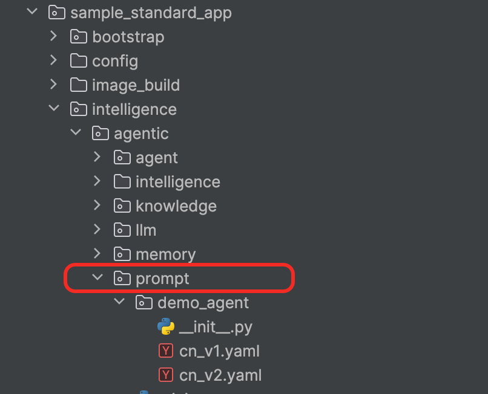

# 文档说明
在本例中我们将进一步向大家介绍如何使用prompt管理模块。

# 使用prompt管理模块
样例地址：[sample_standard_app](../../../../examples/sample_standard_app)

在实际搭建多智能体应用的过程中，我们会面临单一智能体存在多种不同版本prompt的场景（如多语言、单智能体适配不同模型等），如果将prompt信息配置在各个agent yaml中，则增大了用户的prompt管理难度。

我们推荐您将prompt以yaml文件的形式，统一管理在xxx/intelligence/agentic/prompt目录下（`xxx`为项目名称和工程目录），如样例工程的[prompt地址](../../../../examples/sample_standard_app/intelligence/agentic/prompt)。

以agent名称作为子目录名称（如`demo_agent`），子目录下存放当前智能体的所有prompt版本（如`cn_v1` & `cn_v2`），agentUniverse prompt管理模块将为每一个prompt文件赋予唯一的prompt_version进行管理与使用，prompt_version通过**子目录名称+prompt文件名称**组成（如`demo_agent.cn_v1` & `demo_agent.cn_v2`）。 
以sample_standard_app工程中的智能体demo_agent.yaml为例，在配置项中我们可以看到`prompt_version`配置为`demo_agent.cn_v2`，则对应到实际的prompt文件[cn_v2.yaml](../../../../examples/sample_standard_app/intelligence/agentic/prompt/demo_agent/cn_v2.yaml)。

通过这种方式，我们可以通过修改agent yaml中的prompt_version（prompt版本号）将大量prompt有序管理并灵活使用起来。